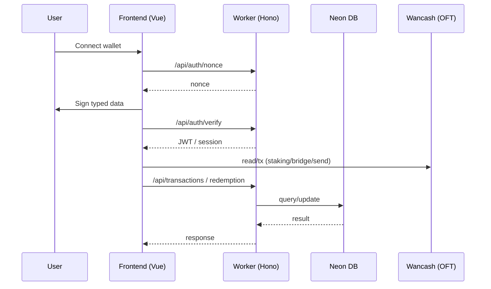

# Project Flow Diagram

## Architecture Overview

```mermaid
flowchart TB
  subgraph Contracts[my-ofts]
    WCH[Wancash (OFT)]
    VEST[WancashVesting]
    STK1[EnhancedStaking]
    STK2[EnhancedStakingUsdt]
    LZ[LayerZero Config]
  end

  subgraph Frontend[my-frontend (Vue)]
    APP[App.vue]
    ROUTER[Router (modules/*)]
    AUTH[useAuth (Wallet + SIWE/EIP712)]
    MODS[Modules: staking/bridge/portfolio/send/admin/etc]
  end

  subgraph Backend[cloude-flare-wancash (Hono Worker)]
    API[/API Routes/]
    AUTHAPI[/auth/nonce + verify/]
    PROFILE[/profile/]
    REDEEM[/redemption/]
    TX[/transactions/]
    STATS[/stats/]
    NOTIF[/notifications/]
    CRON[cron.ts]
    KV[(KV)]
    DB[(Neon DB)]
  end

  subgraph ENV[ENV Flow]
    ENV_OFT[my-ofts/.env.<ENV>]
    ENV_FE[my-frontend/.env.<ENV>]
    VARS_WORKER[.dev.vars / .prod.vars]
  end

  %% ENV sync
  ENV_OFT -->|sync-env.ts| ENV_FE
  ENV_FE -->|generate-env-only.ts| VARS_WORKER

  %% Deploy + vesting flow
  VEST -->|holds supply| WCH
  WCH -->|mint 200M to owner| Contracts
  WCH -->|mint rest to vesting| VEST
  VEST -->|monthly unlock| Treasury[(Treasury)]

  %% App flow
  APP --> ROUTER --> MODS
  MODS --> AUTH
  AUTH -->|nonce request| AUTHAPI
  AUTHAPI --> API
  API --> DB
  API --> KV

  %% Worker flow
  CRON -->|collect price| KV
  CRON -->|aggregate + reconcile| DB
  API --> STATS
```

## Request/Auth Sequence


